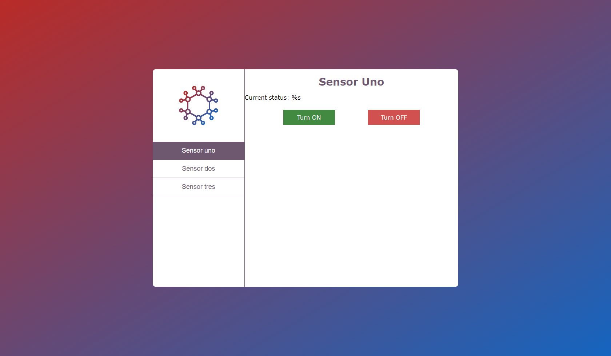
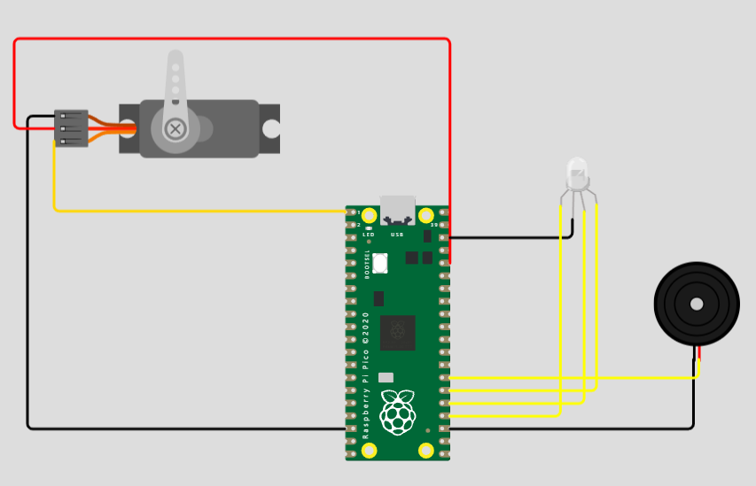

#    Tecnológico Nacional de México
#   Instituto Tecnológico de Tijuana
#        Subdirección Académica
# Departamento de Sistemas y Computación
##  Ingeniería en Sistemas Computacionales
##        SISTEMAS PROGRAMABLES 
## Integrantes: 
## Gerardo Antonio Reyes Armenta 17211147
## Jose Pablo Triana Corvera C18310381
## Eliam Jesús Vazquez Parra 19211748
## Zheng Hu Kenny 19210651
## Osman Argueta Garcia 19210463
##
##   Profesor: MC. René Solis Reyes
##     Semestre AGO - DIC 2022
## 

## PRACTICA 3.2 Web Server

##DIAGRAMA

